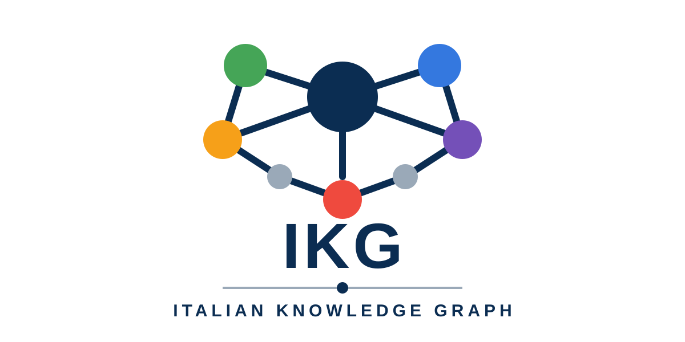

# Italian Knowledge Graph

<p align="center">
  
</p>

<p align="center">
  
  
  
</p>

Italian Knowledge Graph is an open-source platform for building, validating,
improving, sharing, and governing structured knowledge in Italian.

IKG is more than an ontology editor. It connects human-readable knowledge
sources, deterministic rules, quality analysis, reproducible exports, and
reviewable community contributions in one environment for developers and domain
experts.

## Why IKG

Useful knowledge should be:

- **structured**, with explicit identifiers, types, and relationships;
- **verifiable**, through deterministic rules;
- **reusable**, without being tied to one application;
- **collaborative**, with changes that can be reviewed;
- **human-reviewable**, including when tools propose transformations;
- **model-independent**, so no AI provider becomes a source of truth.

The project follows a simple principle:

> **AI may propose. The deterministic Validator verifies. Humans decide.**

The current AI Reviewer uses deterministic heuristics only. Its suggestions are
advisory and never replace Validator findings.

## Why is IKG different?

IKG brings the complete knowledge-maintenance cycle into one environment:
deterministic validation, ontology editing, safe ontology import, knowledge
quality analysis, guided community contribution, and deterministic exports.

Each stage remains inspectable. Sources stay human-readable, transformations
appear in a preview, validation is reproducible, and semantic decisions remain
with people.

## What IKG provides

- **Canonical ontology model**: ordered JSON sources with stable identifiers and
  explicit parent-child structure.
- **Deterministic Validator**: reproducible schema, hierarchy, relationship, and
  integrity findings.
- **Offline Ontology Editor**: a local FastAPI application for safe navigation,
  editing, validation, and saving.
- **Ontology import pipeline**: parser registry, canonical conversion, mapping,
  preview, validation, and confirmed application.
- **Knowledge Quality Center**: diagnostic score, quality checks, statistics, and
  direct navigation to affected nodes.
- **Contribution preparation**: session diff, validation and quality reports,
  reviewable ZIP packages, and optional local Git preparation.
- **Guided contribution packages**: deterministic DOCX templates for people who
  do not work directly with Git or JSON.
- **Deterministic exporters**: validated machine-learning datasets in JSONL and
  CSV.
- **RFC-driven governance**: architectural decisions are recorded under
  [`docs/rfc/`](docs/rfc/README.md).

## Start the UI

Python **3.10 or newer** is required. The launchers do not install Python,
request administrator privileges, or download remote code. The editor binds
only to `127.0.0.1`; ontology data remains local and is not sent online.

### Windows

Double-click `start-ikg.bat`, or run the PowerShell launcher directly:

```powershell
.\start-ikg.ps1
.\start-ikg.ps1 --port 8888
```

### macOS

Authorize the local scripts once, then start from Terminal or double-click
`start-ikg.command` in Finder:

```bash
chmod +x start-ikg.sh start-ikg.command
./start-ikg.command
```

macOS Gatekeeper may show a warning for a script downloaded from the internet.
Review the file and use the normal macOS authorization flow; the launcher does
not disable or bypass Gatekeeper.

### Linux

```bash
chmod +x start-ikg.sh
./start-ikg.sh
```

All platform launchers support `--port PORT`, `--no-browser`, and
`--check-only`. By default the browser opens once at
`http://127.0.0.1:7777`.

## Quick start for developers

Requires **Python 3.10 or newer**. Install and start the editor:

```bash
python -m pip install -e .
python run_editor.py
```

Open the local UI:

```text
http://127.0.0.1:7777
```

Windows PowerShell:

```powershell
Start-Process http://127.0.0.1:7777
```

Custom port:

```bash
python run_editor.py --port 8888
```

Validate:

```bash
ikg validate graph.json
```

Test:

```bash
python -m pytest
```

Regenerate or check the runtime seed:

```bash
python scripts/generate_seed.py
python scripts/generate_seed.py --check
```

## Knowledge model

The canonical hierarchy is:

```text
Macroarea
└── Area
    └── Sottoarea
        └── Concetto
```

`Concetto` is already part of the logical graph model, validation rules,
dataset exporters, and reviewer tooling. The current canonical ontology
population contains macroareas, areas, and subareas, but no concept records yet.

The source of truth is:

- [`ontology/macroareas.json`](ontology/macroareas.json)
- [`ontology/areas.json`](ontology/areas.json)
- [`ontology/subareas.json`](ontology/subareas.json)

[`ontology/seed_compressed.py`](ontology/seed_compressed.py) is a generated
runtime compatibility artifact. Datasets and contribution packages are also
derived artifacts. Generated files must not replace or silently modify their
canonical sources.

## How it works

```text
Knowledge source
       ↓
Import pipeline / Ontology Editor
       ↓
Canonical Converter
       ↓
Deterministic Validator
       ↓
Canonical ontology
       ↓
Knowledge Quality Center
       ↓
Exporters / Contribution workflows
```

The Canonical Converter belongs to the import path. Direct editor changes are
staged in memory and validated against the complete ontology before files are
written.

The end-to-end community loop is:

```text
Knowledge
    ↓
Import / Editor
    ↓
Validator
    ↓
Knowledge Quality
    ↓
📦 Contribution Package
    ↓
Community
    ↓
Importa Ontologia
    ↓
Repository
```

## Ontology Editor

The Ontology Editor is the supported interface for routine ontology changes.
It runs locally and does not require a database or network connection.

It provides:

- an expandable hierarchy with independent navigation scrolling;
- search across ID, Label, and Description;
- Italian, case-insensitive alphabetical ordering by visible Label;
- in-memory creation, update, reparenting, and deletion;
- deterministic ID suggestions;
- complete-graph validation before writing;
- protection against missing parents, invalid hierarchy, and duplicate IDs;
- atomic canonical JSON writes;
- deterministic seed regeneration after a valid save.

The Validator remains authoritative. The UI does not duplicate its rules and
never writes ontology files when validation fails.

## Import Ontology

**Importa Ontologia** accepts:

- **Python** through safe AST parsing; imported Python is never executed;
- **JSON**;
- **YAML** through an internal standard-library parser;
- **Markdown** tables or JSON/YAML fenced content;
- **DOCX** through internal ZIP, OOXML, and XML parsing.

Files are processed as raw bytes without Base64 conversion. The import pipeline
detects the format, parses source data, applies persistent type mappings,
converts to the canonical model, validates the complete result, and displays a
preview.

Blocking errors prevent import. Warnings that may discard non-canonical
properties require explicit acceptance. Collisions and duplicates are reported,
and data is never deleted silently.

## Knowledge Quality Center

The **Knowledge Quality Center** opens in a separate, resizable window. Its tabs
cover:

- Dashboard
- Errori
- Warning
- Copertura
- Statistiche
- Attività
- Checklist

Rows associated with ontology nodes can navigate directly back to the editor.
The Knowledge Quality Score summarizes completeness, integrity, consistency,
documentation, and coverage checks.

The score is diagnostic. It does not replace deterministic validation and
cannot authorize a save.

## Contribute without coding

Domain experts can prepare a contribution without editing JSON or using Git:

1. Open **📦 Crea pacchetto di contributo**.
2. Select a domain, branch, or specific node.
3. Choose what to complete, add, or review.
4. Review the node count, requested fields, and estimated time.
5. Generate the contribution package.
6. Edit `contribution.docx` in Microsoft Word or compatible software.
7. Reimport the document with **Importa Ontologia**.
8. Review warnings and run validation before integration.

The package contains:

- `contribution.docx`
- `README.txt`
- `metadata.json`

Existing IDs, types, labels, language values, and hierarchy are protected during
reimport. The document includes a separate table where new nodes can be
proposed. Imported changes still pass through preview, conversion, and the
authoritative Validator.

## Prepare a repository contribution

**Prepara contributo** becomes available when the editor session differs from
its initial canonical state. It provides:

- added, modified, removed, and excluded node summaries;
- parent relationship changes;
- deterministic validation and integrity checks;
- Quality Reports and before/after quality scores;
- affected canonical files and a readable diff;
- explicit warning acceptance;
- a reproducible review ZIP;
- optional preparation of authorized files in a clean local Git repository;
- a suggested commit title and Pull Request description.

The workflow does **not** run `git commit`, `git push`, merge, reset, branch
changes, or Pull Request creation. Repository actions remain explicit maintainer
decisions.

## Current ontology

Counts are derived from the current canonical JSON and runtime graph:

| Level | Count |
|---|---:|
| Macroareas | 48 |
| Areas | 471 |
| Subareas | 710 |
| Concepts | 0 |
| **Total nodes** | **1,229** |
| Hierarchical `CONTAINS` edges | 1,181 |

The logical model supports concepts; the current canonical dataset contains
zero concept instances.

The ontology is a developing community seed, not a complete or authoritative
representation of all knowledge.

## Export formats

The dataset generator accepts a validated KnowledgeGraph JSON document and
produces stable entity and relationship ordering.

JSONL:

```bash
ikg export dataset \
  --input graph.json \
  --format jsonl \
  --output dataset.jsonl
```

CSV:

```bash
ikg export dataset \
  --input graph.json \
  --format csv \
  --output dataset.csv
```

Both commands validate the input first and stop on validation errors. SQLite,
GraphML, RDF/OWL, and Neo4j exporters are not currently implemented.

The advisory reviewer is available separately:

```bash
ikg review graph.json
```

## Project Documents

- [`README.md`](README.md): project overview, current capabilities, and quick start.
- [`GETTING_STARTED.md`](GETTING_STARTED.md): practical first-use and contribution guide.
- [`MANIFESTO.md`](MANIFESTO.md): vision, principles, and long-term goals.
- [`CONTRIBUTING.md`](CONTRIBUTING.md): contribution workflow and development guidelines.
- [`LICENSE`](LICENSE): Apache License 2.0 governing the project.

## Community

IKG supports two contribution paths:

```text
Developer
    ↓
GitHub
    ↓
Repository

Domain expert
    ↓
📦 Crea pacchetto di contributo
    ↓
DOCX
    ↓
Importa Ontologia
    ↓
Validator
    ↓
Repository
```

### Domain experts and non-developers

Use **📦 Crea pacchetto di contributo** to select a manageable ontology branch,
complete a guided DOCX, and return it through the same import preview used by
maintainers. No Git or direct JSON editing is required.

### Developers and maintainers

Use Issues and Pull Requests for code, ontology, validation, and documentation
changes. Run the Validator and tests before proposing integration.

Project references:

- [`CONTRIBUTING.md`](CONTRIBUTING.md)
- [`docs/ARCHITECTURE.md`](docs/ARCHITECTURE.md)
- [`docs/NODE_SCHEMA.md`](docs/NODE_SCHEMA.md)
- [`docs/AI_REVIEWER.md`](docs/AI_REVIEWER.md)
- [`docs/rfc/`](docs/rfc/README.md)
- [Validator rule index](docs/validator/rules/index.md)

## Project principles

- Canonical ontology JSON is the source of truth.
- Generated artifacts must be reproducible.
- Published identifiers remain stable.
- Imported content is always treated as data.
- Imported Python is parsed and never executed.
- Transformations and discarded properties are visible before import.
- Silent data loss is not allowed.
- The deterministic Validator is authoritative.
- Quality scores and reviewer suggestions are advisory.
- Humans approve semantic changes.
- Runtime dependencies are intentionally limited to FastAPI and Uvicorn; file
  parsers, DOCX generation, seed generation, and contribution packaging use the
  Python standard library.

## Roadmap

### Completed

- Immutable entity, relationship, finding, and report models
- Deterministic validation engine and rule registry
- Relationship validation and backward-compatible graph loading
- Canonical ontology JSON and deterministic compressed seed
- JSONL and CSV dataset exporters
- Deterministic heuristic AI Reviewer architecture
- Offline Ontology Editor
- Multi-format ontology importer and persistent type mapping
- Knowledge Quality Center
- Reviewable repository contribution workflow
- Guided DOCX contribution packages

### In progress

- Community review and correction of the ontology seed
- Documentation alignment across architecture and RFC material
- Hardening editor and import workflows through broader real-world inputs

### Planned

- Populate the existing logical `Concetto` level in canonical ontology data
- Complete editor and importer persistence workflows for concept records
- Canonical fields or models for sources, synonyms, and notes
- Non-hierarchical semantic relationships in the maintained ontology
- Additional deterministic exporters
- Optional reviewer providers, subject to advisory-only boundaries

## Repository structure

```text
italian-knowledge-graph/
├── assets/                 Project visual assets
├── docs/                   Architecture, schema, validator, and RFC documents
├── ontology/               Canonical JSON and generated runtime seed
├── scripts/                Deterministic seed generator
├── src/
│   ├── editor/
│   │   ├── contribution/   Reviewable and guided contribution workflows
│   │   ├── importer/       Parsers, converter, mapping, preview, and import engine
│   │   ├── quality/        Quality checks, registry, and report service
│   │   └── static/         Offline HTML, CSS, and JavaScript UI
│   └── ikg/
│       ├── dataset/        JSONL and CSV dataset generation
│       ├── reviewer/       Advisory reviewer providers and heuristics
│       └── validator/      Deterministic validation engine and rules
└── tests/                  Unit, integration, CLI, editor, and ontology tests
```

## Status and limitations

IKG is in active early development.

- The ontology is broad but incomplete and is not an authoritative reference.
- `Concetto` is supported by the logical model and tooling, but the current
  canonical ontology contains no concept records and the editor does not yet
  provide their complete persistence workflow.
- Sources, synonyms, and notes shown by guided contribution documents are not
  yet persistent canonical fields; the importer reports them before integration.
- The maintained ontology currently contains hierarchical `CONTAINS`
  relationships only.
- The Knowledge Quality Score is diagnostic.
- The AI Reviewer currently uses deterministic heuristics and is advisory.
- The editor is a local development tool, not a hosted multi-user service.

## License

Italian Knowledge Graph is licensed under the
[Apache License 2.0](LICENSE).
